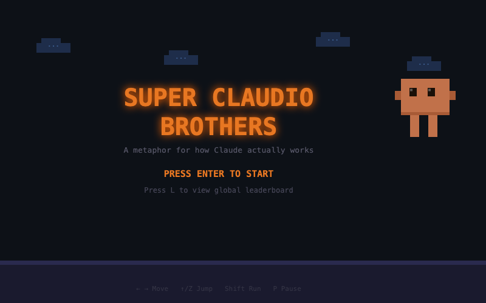

# Super Claudio Brothers

A Claude Code skill that generates a unique Mario-style platformer every time you run it. Pick a theme, and it builds you a custom game with its own colour palette, level layout, enemy style, and Claudio costume.



## Get started

Copy `skills/super-claudio-brothers/` to `~/.claude/skills/`, then run `/super-claudio-brothers` in Claude Code.

You'll get five options: Classic Claudio (the original, launches instantly) or four randomly generated themes. Pick one, type your own, and the skill builds your game in seconds. Every version is different.

## How it works

The game engine lives in `template.html` with a replaceable theme block. The skill generates ~40 lines of themed JS (colours, level params, costume, background art) and injects them with `sed`. It never reads the 54KB template into context, so generation is fast and cheap.

## The game

You play as Claudio, stomping gremlins across an overworld and underground zone. Question blocks, tokens, pipes, a checkpoint, power-ups (System Prompt makes you big, stars give invincibility), three lives, and a global leaderboard.

Single HTML file. Vanilla JS, Canvas 2D, Web Audio API for all sound. No dependencies, no build step. Open `index.html` in any browser to play the original.

### Controls

| Key | Action |
|-----|--------|
| Arrow keys / WASD | Move |
| Up / Z / Space | Jump |
| Shift | Run |
| Down (on pipe) | Enter/exit underground |
| P | Pause |
| L | Leaderboard |

## Project structure

```
index.html          # The original playable game
template.html       # Engine with replaceable THEME block
schema.sql          # Supabase leaderboard schema
skills/             # Claude Code skill for themed generation
screenshots/        # README images
CLAUDE.md           # Project context for Claude Code
```
